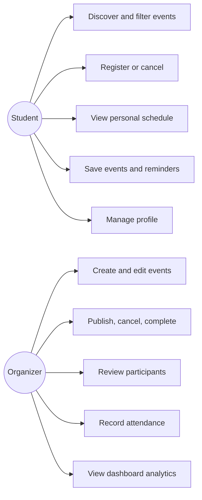
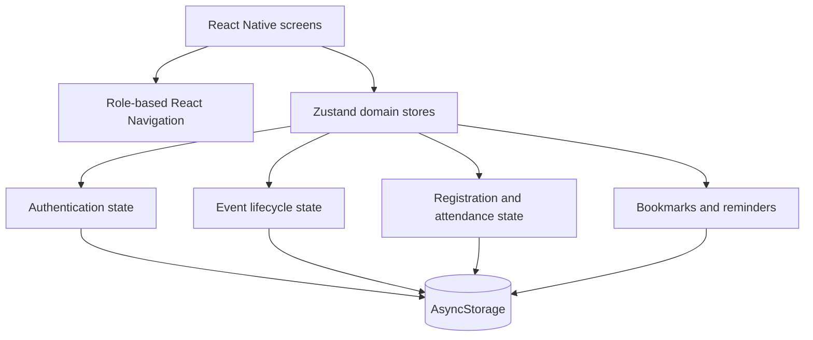
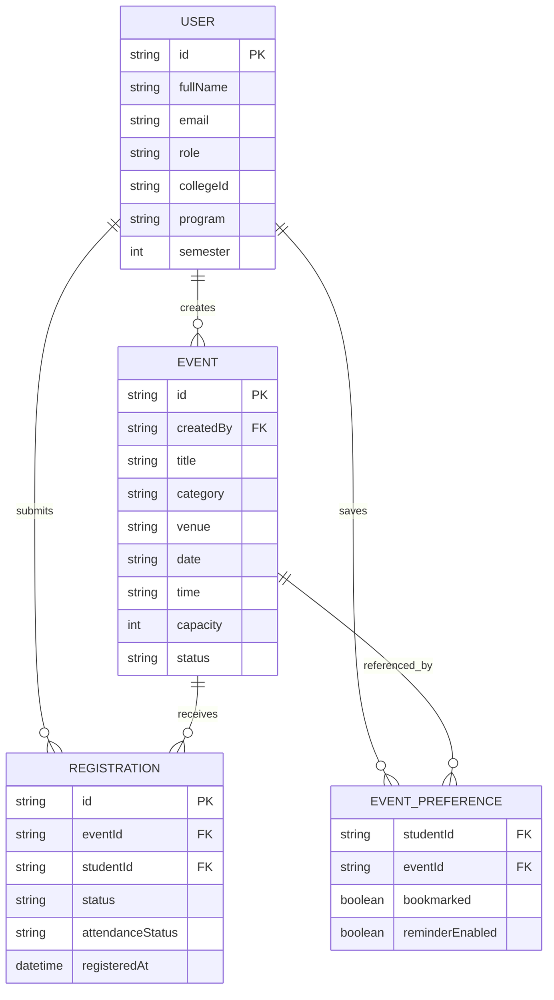

# CampusConnect Project Report

## 1. Problem statement

Campus announcements are often distributed across notice boards, chat groups, and social media. Students can miss deadlines, organizers cannot reliably estimate attendance, and participant records become difficult to maintain. CampusConnect centralizes discovery, registration, scheduling, and organizer operations in one mobile application.

## 2. Objectives

- Give students a searchable catalog of verified campus events.
- Prevent registration beyond capacity or after a deadline.
- Give students a durable personal schedule, saved list, and reminders.
- Let organizers manage the full event lifecycle and attendance.
- Provide a clear base for future cloud synchronization and push notifications.

## 3. Actors and use cases

## 4. System architecture

## 5. Entity relationship model

## 6. Core business rules

1. Only authenticated students can register.
2. Only published events accept registrations.
3. Active registration count cannot exceed event capacity.
4. Registrations cannot be created after a valid deadline.
5. An organizer cannot reduce capacity below active registrations.
6. Cancelled registrations do not consume capacity.
7. Attendance can be recorded only for active registrations.
8. Deleting an event removes its local registrations and preferences.

## 7. Test plan

| ID | Scenario | Expected result |
|---|---|---|
| T01 | Login with invalid email | Validation message is shown |
| T02 | Login with short password | Validation message is shown |
| T03 | Register for published event | Registration succeeds and schedule updates |
| T04 | Register twice | Duplicate registration is prevented |
| T05 | Register for full event | Event Full message is shown |
| T06 | Register after deadline | Registration Closed message is shown |
| T07 | Cancel registration | Schedule and available capacity update |
| T08 | Save an event and restart | Saved event remains available |
| T09 | Enable reminder | Notification center reflects the reminder |
| T10 | Create draft event | Event is hidden from student discovery |
| T11 | Publish draft event | Event becomes visible to students |
| T12 | Reduce capacity below registrations | Organizer receives validation error |
| T13 | Mark attendance | Participant state and totals update |
| T14 | Delete event | Event, local registrations, and preferences are removed |
| T15 | Edit student profile | Updated information persists locally |

## 8. Current limitations

This version uses local device persistence. Accounts and event changes are not shared across devices, notifications are in-app rather than remote push notifications, and poster images use remote URLs. These limitations are intentionally isolated behind domain stores so a cloud data layer can replace local persistence later.

## 9. Recommended production extension

- Supabase Auth for real identity and password recovery.
- PostgreSQL tables matching the entity model above.
- Row-level security for student and organizer permissions.
- Supabase Storage for event posters.
- Edge Functions for trusted capacity enforcement.
- Expo Notifications for scheduled and remote alerts.
- QR tickets containing a signed registration identifier.
